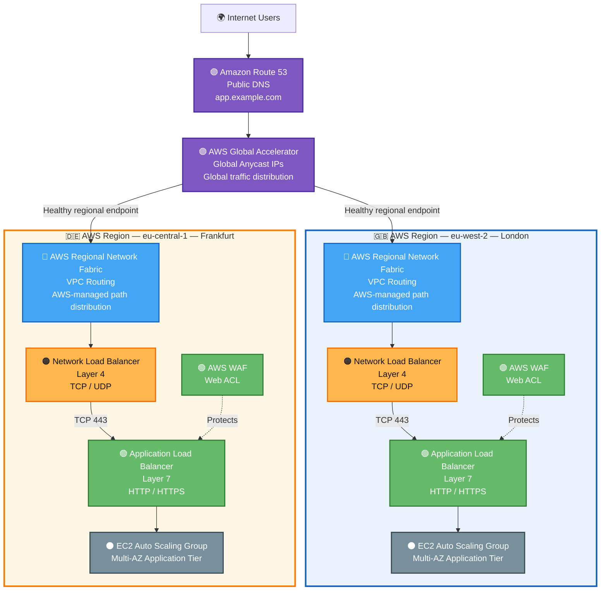
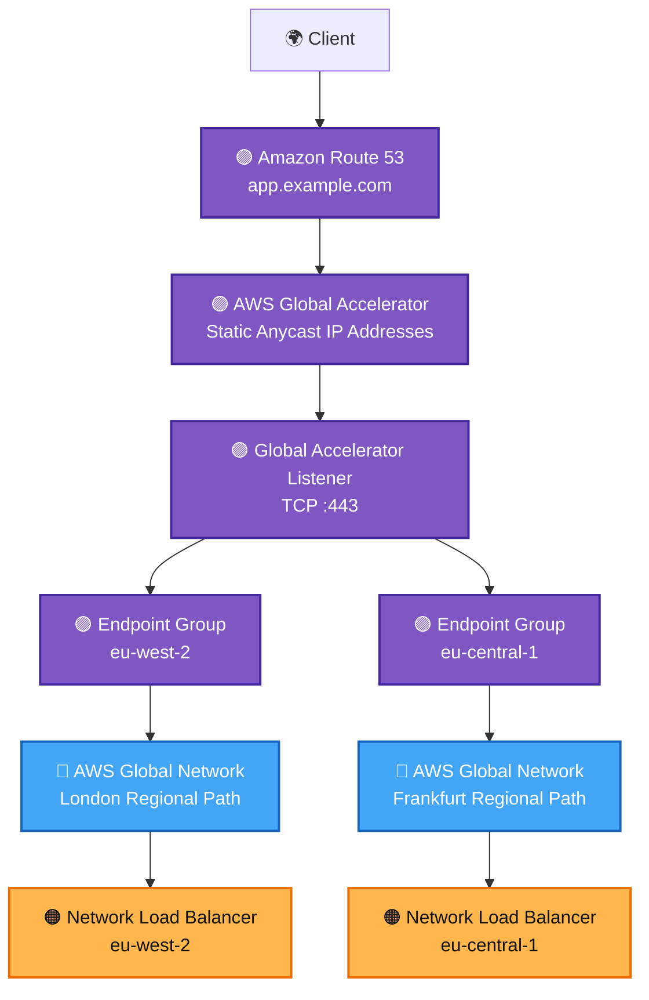
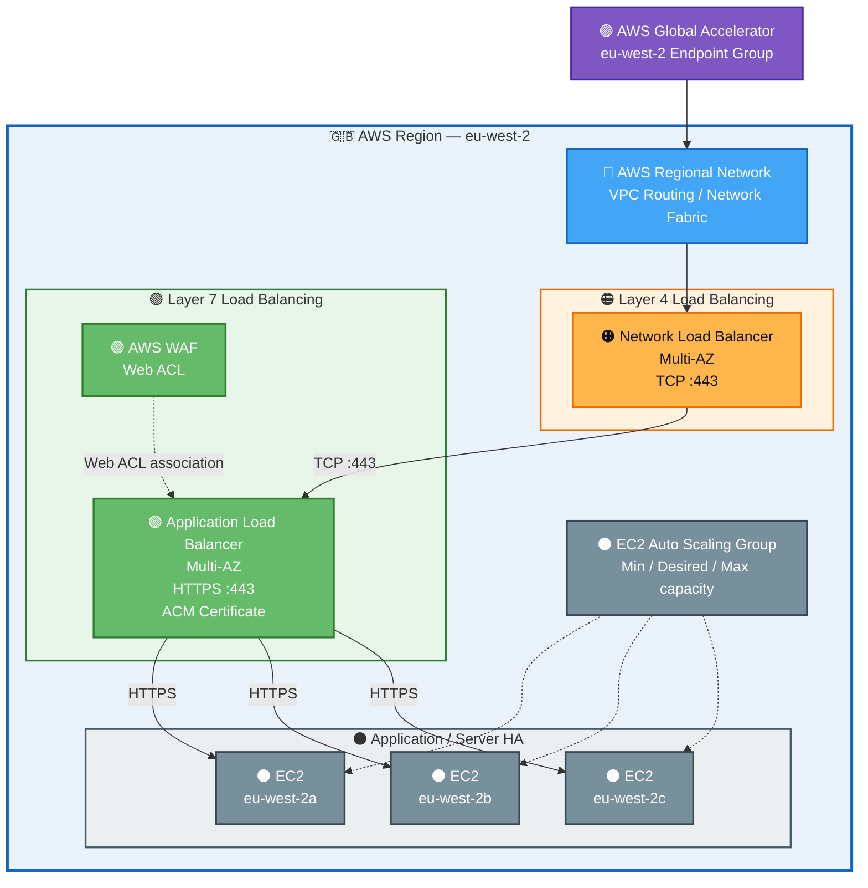
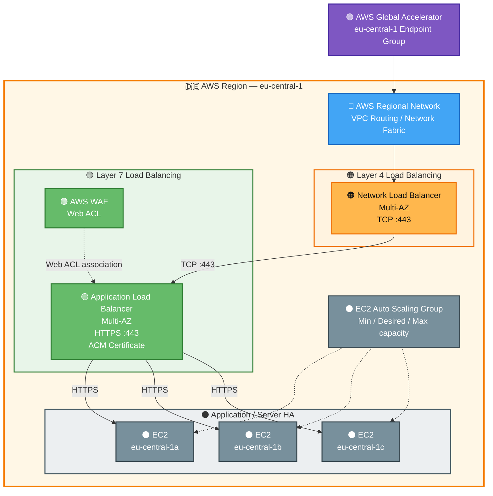
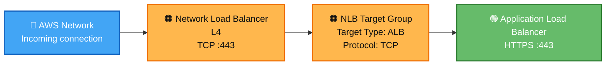
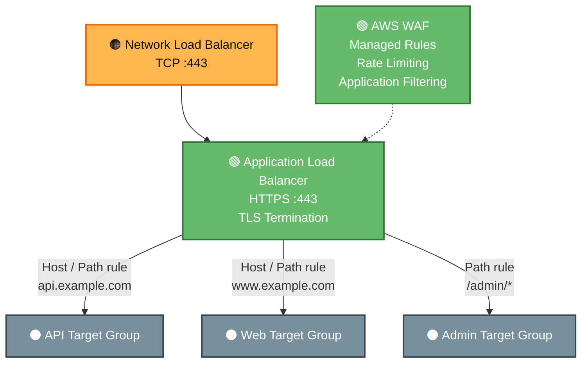
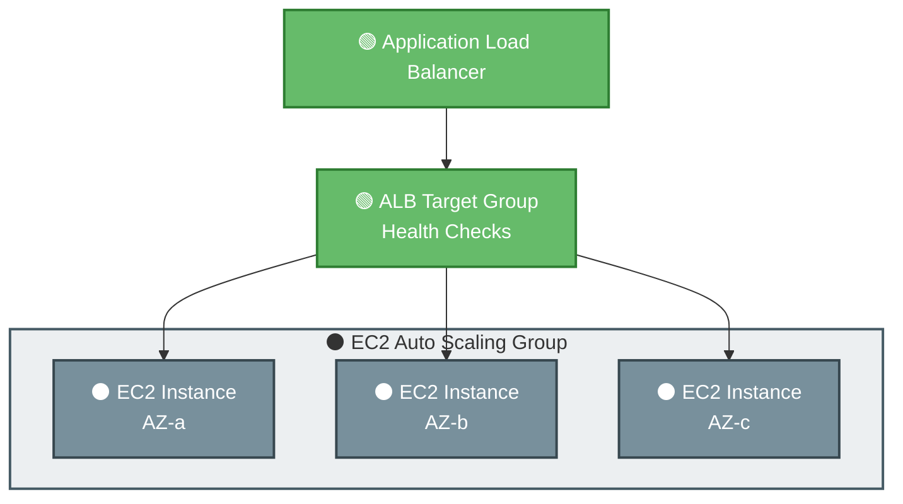

# AWS High Availability and Global Load Balancing Architecture

## Overview

This document maps a traditional highly available, multi-region architecture onto AWS managed services.

The conceptual traffic path is:

```text
🟣 Global / Anycast
        ↓
🔵 Routing / ECMP
        ↓
🟠 Layer 4 Load Balancing
        ↓
🟢 Layer 7 Load Balancing
        ↓
⚫ Application Servers
```

On AWS, this becomes:

```text
Amazon Route 53
        ↓
AWS Global Accelerator
        ↓
AWS-managed Global / Regional Network
        ↓
Network Load Balancer
        ↓
Application Load Balancer + AWS WAF
        ↓
EC2 Auto Scaling Group
        ↓
EC2 instances across multiple Availability Zones
```

The architecture uses two AWS Regions:

- 🇬🇧 `eu-west-2` — London
- 🇩🇪 `eu-central-1` — Frankfurt

---

## Colour Scheme

The diagrams use consistent colours to identify architectural layers.

| Colour | Layer | AWS implementation |
|---|---|---|
| 🟣 Purple | Global / Anycast | Route 53, Global Accelerator |
| 🔵 Blue | Routing / ECMP | AWS global network, regional network fabric, VPC routing |
| 🟠 Orange | Layer 4 | Network Load Balancer |
| 🟢 Green | Layer 7 | Application Load Balancer, AWS WAF |
| ⚫ Slate/Grey | Application | EC2, Auto Scaling |
| 🇬🇧 / 🇩🇪 Tint | Region | AWS Region boundary |

---

# High-Level Architecture



---

# Global Ingress Implementation

The global tier provides a single service entry point and distributes clients between AWS Regions.



## Global Traffic Flow

```text
Client
  ↓
Route 53
  ↓
Global Accelerator Anycast IP
  ↓
Nearest AWS edge location
  ↓
AWS global network
  ↓
Global Accelerator endpoint group
  ↓
Healthy regional Network Load Balancer
```

Global Accelerator is responsible for **regional traffic distribution and failover**.

It replaces much of what would traditionally be implemented using:

```text
Internet BGP
   ↓
Anycast advertisement
   ↓
Edge router
   ↓
Regional routing decision
```

with an AWS-managed global service.

---

# London Regional Implementation

Region:

```text
eu-west-2 — London
```

The regional architecture is deployed across multiple Availability Zones.



## London Traffic Path

```text
AWS Global Accelerator
        ↓
eu-west-2 endpoint
        ↓
AWS regional network
        ↓
Network Load Balancer
        │
        │ TCP :443
        ↓
Application Load Balancer
        │
        ├── AWS WAF
        ├── ACM TLS certificate
        │
        ↓
ALB Target Group
        ↓
EC2 Auto Scaling Group
       /    |    \
      /     |     \
eu-west-2a  2b   eu-west-2c
```

---

# Frankfurt Regional Implementation

Region:

```text
eu-central-1 — Frankfurt
```

Frankfurt follows the same regional pattern but represents an independent regional failure domain.



---

# Layer 4 Implementation

AWS Network Load Balancer provides the Layer 4 tier.



The NLB provides transport-layer handling while passing the connection to the L7 tier.

Conceptually:

```text
Source IP
Source Port
Destination IP
Destination Port
Protocol
       ↓
      NLB
       ↓
TCP connection distribution
```

The NLB does not need to make HTTP path or hostname routing decisions.

---

# Layer 7 Implementation

The Application Load Balancer provides application-aware routing.



For example:

```text
api.example.com
        ↓
API Target Group


www.example.com
        ↓
Web Target Group


www.example.com/admin/*
        ↓
Admin Target Group
```

This is the point where HTTP-aware routing decisions occur.

---

# Application Server HA

The application tier uses EC2 Auto Scaling across multiple Availability Zones.



The design avoids treating an individual EC2 instance as persistent infrastructure.

If an instance fails:

```text
EC2 unhealthy
      ↓
ALB health check fails
      ↓
Instance removed from serving traffic
      ↓
Auto Scaling replaces capacity
      ↓
New instance becomes healthy
      ↓
ALB begins routing traffic to it
```

---

# Availability Model

The design provides several independent HA layers.

| Failure | AWS response |
|---|---|
| Application process failure | ALB health checks remove unhealthy target |
| EC2 instance failure | Auto Scaling replaces instance |
| Availability Zone failure | Remaining AZs continue serving |
| Load-balancer infrastructure failure | AWS manages NLB/ALB service HA |
| Regional application failure | Global Accelerator routes towards another healthy regional endpoint |
| Public service IP | Global Accelerator provides global static Anycast addresses |

The failure domains can therefore be viewed as:

```text
Individual process
       ↓
EC2 instance
       ↓
Availability Zone
       ↓
AWS Region
       ↓
Global AWS deployment
```

---

# Routing and ECMP on AWS

The traditional architecture contains an explicit layer such as:

```text
              Router
             /      \
           ECMP     ECMP
           /          \
        L4-01        L4-02
```

AWS normally abstracts this layer.

The equivalent application ingress path is better represented as:

```text
Global Accelerator
        ↓
AWS global network
        ↓
AWS regional network fabric
        ↓
Network Load Balancer
```

The following blue node in the diagrams:

```text
🔵 AWS Regional Network Fabric
```

is therefore a **conceptual architecture layer rather than a resource that needs to be provisioned**.

There is normally no requirement to deploy:

```text
EC2 router01
EC2 router02
VRRP
BGP
Keepalived
```

in front of an AWS Network Load Balancer.

Where explicit hub-and-spoke routing, hybrid connectivity or network-path control is required, services such as **AWS Transit Gateway** may form part of the routing architecture.

---

# NLB and ALB HA

An important difference between AWS and traditional infrastructure is that the load balancers are managed services.

Traditional deployment:

```text
          VIP
           |
     +-----+-----+
     |           |
   LB01        LB02
```

AWS deployment:

```text
        Network Load Balancer
              Multi-AZ
```

and:

```text
      Application Load Balancer
              Multi-AZ
```

There is therefore no customer-managed:

```text
nlb01
nlb02

alb01
alb02
```

pair.

The logical AWS load balancer spans the configured Availability Zones while AWS operates the underlying load-balancing infrastructure.

---

# Network Load Balancer to Application Load Balancer

The explicit L4 → L7 design uses:

```text
Network Load Balancer
        ↓
NLB Target Group
Target Type: ALB
        ↓
Application Load Balancer
```

This allows the architecture to retain a dedicated Layer 4 tier followed by a Layer 7 tier.

Typical traffic flow:

```text
Global Accelerator
        ↓
NLB TCP :443
        ↓
NLB Target Group
Target Type: ALB
        ↓
ALB HTTPS :443
        ↓
AWS WAF
        ↓
ALB Target Group
        ↓
EC2 HTTPS :443
```

---

# TLS

A sensible TLS model is:

```text
Client
  │
  │ HTTPS
  ↓
Global Accelerator
  │
  │ TCP :443
  ↓
Network Load Balancer
  │
  │ TCP :443
  ↓
Application Load Balancer
  │
  ├── ACM Certificate
  │
  │ HTTPS
  ↓
EC2
```

AWS Certificate Manager can provide the certificate used by the ALB HTTPS listener.

For security-sensitive environments, TLS can also be maintained between the ALB and application instances:

```text
Client
   ↓ HTTPS
ALB
   ↓ HTTPS
EC2
```

rather than transmitting HTTP plaintext within the VPC.

---

# AWS WAF

AWS WAF is associated with the Application Load Balancer.

```text
              AWS WAF
                 │
                 │ Web ACL
                 ↓
NLB ────────> ALB ────────> EC2
 L4             L7
```

Potential controls include:

- AWS Managed Rules
- known malicious request patterns
- SQL injection protections
- cross-site scripting protections
- IP allow/block lists
- rate-based rules
- bot controls
- geographic restrictions where required

WAF belongs conceptually to the **green L7 security/application tier** rather than the orange L4 tier.

---

# VPC Design

A production deployment should separate application responsibilities into appropriate subnets.

A simplified regional VPC could look like:

```text
VPC
│
├── Load Balancer Subnets
│   ├── AZ-a
│   ├── AZ-b
│   └── AZ-c
│
├── Application Subnets
│   ├── AZ-a
│   ├── AZ-b
│   └── AZ-c
│
└── Data Subnets
    ├── AZ-a
    ├── AZ-b
    └── AZ-c
```

Application EC2 instances should normally have no requirement for directly accessible public addresses.

The intended inbound path remains:

```text
Internet
   ↓
Global Accelerator
   ↓
NLB
   ↓
ALB + WAF
   ↓
Private application instances
```

---

# Full Request Flow

A complete request can therefore traverse:

```text
🌍 Client
     │
     ↓
🟣 Amazon Route 53
     │
     ↓
🟣 AWS Global Accelerator
     │
     │ Anycast / regional selection
     ↓
🔵 AWS Global Network
     │
     ↓
🔵 AWS Regional Network
     │
     ↓
🟠 Network Load Balancer
     │
     │ TCP
     ↓
🟢 Application Load Balancer
     │
     ├── AWS WAF
     ├── ACM
     ├── Host routing
     └── Path routing
     │
     ↓
🟢 ALB Target Group
     │
     ↓
⚫ EC2 Auto Scaling Group
     │
     ├── EC2 — AZ-a
     ├── EC2 — AZ-b
     └── EC2 — AZ-c
```

---

# Service Mapping

| Architecture function | AWS service |
|---|---|
| DNS | Amazon Route 53 |
| Global Anycast | AWS Global Accelerator |
| Global routing | AWS Global Accelerator / AWS global network |
| Regional routing | Amazon VPC / AWS-managed regional network |
| Explicit enterprise routing | AWS Transit Gateway where required |
| L4 load balancing | Network Load Balancer |
| L7 load balancing | Application Load Balancer |
| Application firewall | AWS WAF |
| TLS certificates | AWS Certificate Manager |
| Server HA | EC2 Auto Scaling |
| Compute | Amazon EC2 |
| Health-based backend routing | ELB Target Groups |
| Metrics / logs | Amazon CloudWatch |
| Audit | AWS CloudTrail |

---

# Architecture Summary

The traditional architecture:

```text
Anycast
   ↓
BGP
   ↓
Edge Router
   ↓
ECMP
   ↓
L4 Load Balancer Pair
   ↓
L7 Load Balancer Pair
   ↓
Server Cluster
```

maps onto AWS as:

```text
🟣 Route 53
       ↓
🟣 Global Accelerator
       ↓
🔵 AWS Global Network
       ↓
🔵 AWS Regional Network / VPC
       ↓
🟠 Network Load Balancer
       ↓
🟢 Application Load Balancer + WAF
       ↓
⚫ EC2 Auto Scaling Group
       ↓
⚫ Multi-AZ EC2 instances
```

This provides high availability at multiple independent levels:

```text
Global HA
    ↓
Regional HA
    ↓
Availability Zone HA
    ↓
Load Balancer HA
    ↓
Application Server HA
```

## Design Note: Is the NLB Always Required?

No.

For a normal HTTP/HTTPS application, the simpler architecture may be:

```text
Route 53
    ↓
Global Accelerator
    ↓
Application Load Balancer
    ↓
EC2 Auto Scaling
```

Global Accelerator can use an Application Load Balancer directly as an endpoint.

The explicit:

```text
NLB
 ↓
ALB
```

architecture is useful where the design specifically requires both Layer 4 and Layer 7 capabilities, such as:

- retaining a distinct L4 ingress tier
- static regional IP requirements
- AWS PrivateLink integration
- combining TCP/network functionality with HTTP-aware routing
- multi-protocol architectures

For this reference architecture, the NLB and ALB are intentionally shown separately to demonstrate the relationship between **Layer 4 and Layer 7 high availability**.
