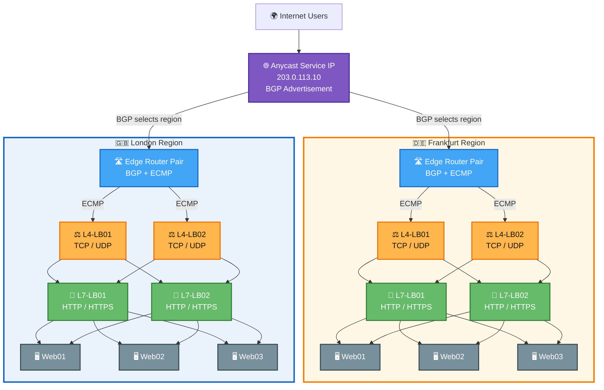

# Larger Production Architecture (HA)

## Summary

| Colour    | Layer                   | Function                                                                  |
| --------- | ----------------------- | ------------------------------------------------------------------------- |
| 🟣 Purple | 🌐 **Anycast**          | Distributes users between geographic regions / PoPs                       |
| 🔵 Blue   | 🛣️ **BGP**             | Advertises and provides reachability to the service IP                    |
| 🔵 Blue   | 🔀 **ECMP**             | Distributes flows across equivalent network paths / L4 nodes              |
| 🟠 Orange | ⚖️ **L4 Load Balancer** | TCP/UDP connection distribution                                           |
| 🟢 Green  | 🔀 **L7 Load Balancer** | HTTP/HTTPS routing, TLS termination, and host/path/header-based decisions |
| ⚫ Slate   | 🖥️ **Server HA**       | Multiple application instances provide service resilience                 |

## Mermaid

- 🟣 Global / Anycast
- 🔵 Routing / ECMP
- 🟠 L4 load balancing
- 🟢 L7 load balancing
- ⚫ Application servers — slate/grey
- 🇬🇧 / 🇩🇪 Regions

---

