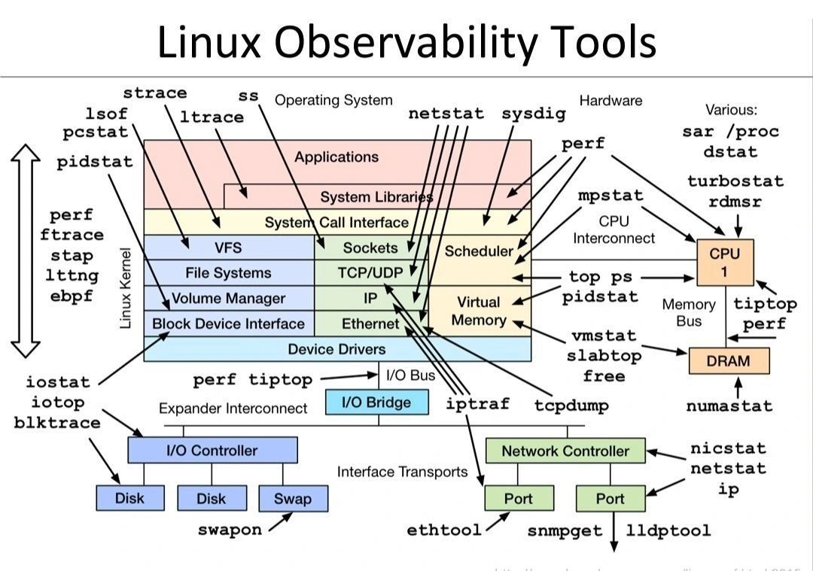

# Linux Observability Tools — A Practical Guide

Observability is the ability to understand what a Linux system is doing *internally* by examining the signals it emits — metrics, logs, traces, and events.  
This guide provides a structured overview of Linux observability tools, grouped by the system layers they inspect. It is designed as a practical reference for troubleshooting, performance engineering, capacity planning, and DevSecOps workflows.

---

## Table of Contents
- [🧱 1. Application & User-Space Observability](#-1-application--user-space-observability)
- [🧩 2. System Libraries & Syscall Interface](#-2-system-libraries--syscall-interface)
- [🧬 3. Kernel Subsystems Observability](#-3-kernel-subsystems-observability)
- [🔩 4. Device Drivers & Block Layer Observability](#-4-device-drivers--block-layer-observability)
- [📦 5. Storage & Swap Observability](#-5-storage--swap-observability)
- [🌐 6. Network Stack & NIC Observability](#-6-network-stack--nic-observability)
- [🖥️ 7. Hardware Observability (CPU, RAM, Buses)](#-7-hardware-observability-cpu-ram-buses)
- [📊 8. System-Wide Observability Tools](#-8-system-wide-observability-tools)

---

## 📊 Overview Diagram

> Diagram © Brendan Gregg — used here with attribution for educational and informational purposes.  

The diagram maps common observability tools to layers of the Linux operating system, from user-space applications down to hardware, providing a mental model for selecting the right tool during analysis or incident response.

---

# 🧱 1. Application & User-Space Observability

These tools inspect behaviour at the *process and application* level, including interactions with system libraries.

### 🔧 Tools
- **strace** – traces system calls made by an application.  
- **ltrace** – traces dynamic library calls.  
- **ss** – modern socket statistics (replacement for `netstat`).  
- **netstat** – legacy but still useful for connection state overview.  
- **sysdig** – system-wide syscall/event capture and filtering.  
- **lsof** – lists open files, sockets, pipes, etc.  
- **pidstat** – per-process CPU, memory, I/O, threads.  
- **pcstat** – page cache statistics for specific files.

### 🧠 When to use
- Debugging why an application is slow or blocked.  
- Identifying network usage per process.  
- Auditing open files and ports.  
- Understanding syscall patterns for performance tuning.

---

# 🧩 2. System Libraries & Syscall Interface

This layer sits between applications and the kernel. Tools here help examine transitions between user-space and kernel-space.

### 🔧 Tools
- **strace / ltrace** – observe execution flow into syscalls and libraries.  
- **perf** – syscall latency, profiling, hotspots.  
- **ftrace** – built-in kernel tracer for syscalls and function calls.  
- **SystemTap (stap)** – programmable probes for syscalls.  
- **LTTng** – high-performance tracing for production systems.  
- **eBPF / bpftrace** – modern, safe kernel-level instrumentation.

### 🧠 When to use
- Diagnosing syscall bottlenecks.  
- Monitoring unexpected kernel interactions.  
- High-resolution production tracing with low overhead (eBPF).

---

# 🧬 3. Kernel Subsystems Observability

The kernel handles filesystems, memory management, scheduling, and networking. Tools here inspect these internal mechanisms.

### 🔧 Tools
- **perf** – scheduler behaviour, CPU cycles, kernel hotspots.  
- **tcpdump** – raw packet capture at the IP/Ethernet layers.  
- **iptraf** – lightweight network utilisation monitor.  
- **vmstat** – processes, memory, swap, I/O, interrupts.  
- **slabtop** – kernel slab allocator usage.  
- **free** – memory allocation breakdown.  
- **pidstat** – scheduler awareness and per-thread stats.  
- **tiptop** – per-thread metrics using hardware counters.

### 🧠 When to use
- Identifying memory pressure, leaks, or slab exhaustion.  
- Determining network packet loss or congestion.  
- Analysing scheduler-induced latency.  
- Understanding kernel-side performance issues.

---

# 🔩 4. Device Drivers & Block Layer Observability

These tools examine I/O as it flows through the Linux block subsystem.

### 🔧 Tools
- **iostat** – block device throughput and latency.  
- **iotop** – per-process disk I/O usage.  
- **blktrace** – very detailed block layer tracing.  
- **perf / tiptop** – device driver profiling.

### 🧠 When to use
- Troubleshooting slow disk I/O.  
- Detecting I/O starvation or noisy-neighbour workloads.  
- Analysing LVM/RAID performance issues.

---

# 📦 5. Storage & Swap Observability

Tools focusing on physical disks, logical volumes, controllers, and swap usage.

### 🔧 Tools
- **iostat** – read/write performance.  
- **iotop** – which processes are causing I/O.  
- **blktrace** – kernel-level I/O event tracing.  
- **swapon -s** – view swap devices and utilisation.

### 🧠 When to use
- Swap thrash detection.  
- Disk queue depth analysis.  
- Understanding storage behaviour under load.

---

# 🌐 6. Network Stack & NIC Observability

These tools examine network interfaces, Ethernet drivers, ports, and NIC statistics.

### 🔧 Tools
- **tcpdump** – packet-level visibility.  
- **ss / netstat** – connections and sockets.  
- **iptraf** – per-interface traffic charts.  
- **ethtool** – NIC driver settings and link state.  
- **nicstat** – interface utilisation.  
- **lldptool** – LLDP neighbour discovery.  
- **snmpget** – SNMP-based network metrics.

### 🧠 When to use
- Packet drops, retransmits, or MTU mismatches.  
- NIC offload tuning (TSO, GRO, etc.).  
- Link speed/duplex mismatch troubleshooting.

---

# 🖥️ 7. Hardware Observability (CPU, RAM, Buses)

These tools provide insights into how the **hardware itself** behaves — including CPU frequency, power states, performance counters, NUMA locality, memory pressure, cache behaviour, and bus throughput.

## 🔧 CPU Tools

- **mpstat** – Reports CPU usage per core, showing utilisation, steal time, IRQ time, and more.
- **top** – Real-time process monitoring with CPU, load average, and per-thread breakdowns.
- **ps** – Snapshot of process states, CPU usage, memory usage, and scheduling information.
- **pidstat** – Per-thread and per-process CPU utilisation, context switching, and scheduling metrics.
- **perf** – Hardware performance counter profiler (cycles, cache misses, branch mispredictions).
- **turbostat** – Intel-specific tool showing CPU frequencies, C-states, P-states, and turbo boost behaviour.
- **rdmsr** – Reads CPU model-specific registers (MSRs) for extremely low-level introspection.

---

## 🔧 Memory Tools

- **vmstat** – Shows paging, swapping, memory pressure, interrupts, and system-wide throughput.
- **free** – Reports total, used, cached, and available system memory.
- **slabtop** – Displays kernel slab allocator statistics (caches, objects, memory used).
- **numastat** – NUMA locality, node memory distribution, and remote memory access counts.
- **perf (memory events)** – Analyses hardware counters related to RAM, cache, and memory bus traffic.

---

## 🧠 When to use
- NUMA locality and cross-node memory access debugging.  
- CPU throttling, frequency scaling, or thermal throttling investigations.  
- Memory pressure analysis, leaking workloads, or kernel slab issues.  
- High-performance tuning for compute-heavy or latency-sensitive workloads.

---

# 📊 8. System-Wide Observability Tools

These tools cover multiple layers at once.

### 🔧 Tools
- **sar** – historic performance logs across CPU, memory, I/O, network.  
- **dstat** – live multi-metric system aggregation.  
- **sysdig** – holistic tracing across syscalls, network, containers.  
- **/proc** – raw kernel data for metrics, states, drivers, and interfaces.

### 🧠 When to use
- Incident response and baselining.  
- Long-term trending and anomaly detection.  
- System-wide correlation across resources.

---

# 🛠️ Practical Use Cases

### ✔ Root Cause Analysis (RCA)
- Identify if a slowdown is CPU, memory, network, or storage related.  
- Trace a misbehaving process through syscalls into the kernel.  
- Compare observed performance against baseline.

### ✔ Performance Tuning
- Scheduler tracing for latency-sensitive workloads.  
- NIC tuning via `ethtool` for high-throughput environments.  
- Storage insight for LVM/RAID/SSD/HDD tuning.

### ✔ DevSecOps / Security
- eBPF tools for detecting suspicious syscalls.  
- `lsof` for auditing unexpected open sockets/files.  
- `sysdig` rules for behavioural anomaly detection.

A secure system is one that is *understood*, not just hardened.

---

# 🔐 Observability in DevSecOps

Observability is not just operational — it is *security-critical*:

- Detect unusual syscall patterns (possible intrusion).  
- Identify crypto miners via CPU and scheduler patterns.  
- Spot exfiltration via abnormal NIC or TCP behaviour.  
- Validate hardening changes improve performance rather than degrade it.

---

# 🧭 Future Enhancements

Potential expansions to this guide:

- eBPF cookbook examples (uprobe, kprobe, tracepoint).  
- Container observability tools (cAdvisor, bcc tools).  
- Systemd journal analysis patterns.  
- Kernel flamegraphs and performance visualisation.

PRs and contributions are welcome.

---

# 📚 References

- Brendan Gregg — *Linux Performance Tools*  
- Kernel documentation — https://www.kernel.org/doc/  
- Sysdig, LTTng, SystemTap official docs  
- eBPF / bpftrace reference guides  
