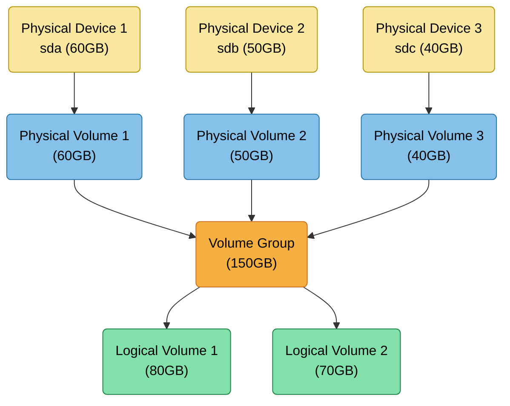

# 📦 Logical Volume Manager (LVM)

LVM provides a flexible, abstraction-based storage layer on Linux.  
Instead of partitioning disks directly, LVM lets you pool storage from multiple devices and allocate space dynamically.  
This improves scalability, snapshotting, resizing, and overall storage management.

---

## 🟦 Physical Volume (PV)

A Physical Volume is a disk or partition prepared for use by LVM.  
It represents the lowest LVM layer, created from real storage devices (e.g., `/dev/sda`, RAID LUNs).

**Key points:**
- Created with `pvcreate`
- Forms the building blocks of a VG
- Can be added or removed to adjust total capacity

---

## 🟧 Volume Group (VG)

A Volume Group aggregates one or more PVs into a single storage pool.  
This pool behaves like one large virtual disk.

**Key points:**
- Created with `vgcreate`
- Expands by adding more PVs
- Space is allocated to LVs from the VG

---

## 🟩 Logical Volume (LV)

A Logical Volume is carved out of a Volume Group and behaves like a virtual partition.  
Filesystems, swap, containers, or VMs are placed on LVs.

**Key points:**
- Created with `lvcreate`
- Can be resized dynamically
- Supports snapshots and thin provisioning

## Mermaid LVM2

- 🟨 **Physical Device (PD)**
- 🟦 **Physical Volume (PV)**
- 🟧 **Volume Group (VG)**
- 🟩 **Logical Volume (LV)**

---

