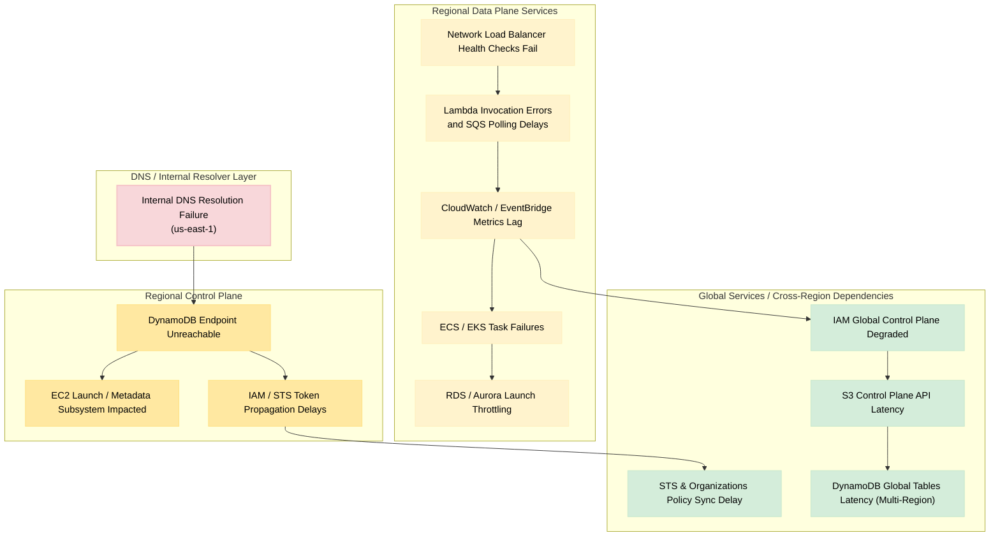

# 🧩 AWS Outage — US-EAST-1 (19–20 Oct 2025)

## 📘 Overview
Between **19 Oct 2025 23:49 PDT** and **20 Oct 2025 15:01 PDT**, AWS experienced a major regional outage in **US-EAST-1 (N. Virginia)**, resulting in elevated error rates and latencies across **142 services**.  
Root cause: a **DNS resolution failure** for **DynamoDB API endpoints** within the region, which cascaded into the **EC2 control plane** and **Network Load Balancer health subsystems**, affecting dependent services globally.

AWS confirmed full recovery by 15:01 PDT, with residual backlogs cleared over subsequent hours.

This document summarises:

  - [Overview](#-overview)
  - [Root Cause](#-root-cause)
  - [Timeline](#-timeline-pdt--utc-7)
  - [Impact](#-impact)
  - [Contributing Factors](#-contributing-factors)
  - [Lessons Learned](#-lessons-learned-devops--devsecops--sre)
  - [Architecture Diagram](#-architecture-simplified-impact-flow)
  - [Architecture (Full Impact)](#-architecture-full-impact--fault-isolation-view)

---

## 🧠 Root Cause
- **Primary trigger:** DNS resolution failure for `dynamodb.us-east-1.amazonaws.com`.  
- **Cascading impact:**  
  - EC2 internal control subsystems relied on DynamoDB tables for instance-launch metadata.  
  - Failed lookups caused **instance launch throttling** and **autoscaling failures**.  
  - **NLB health checks** became impaired, breaking Lambda and CloudWatch connectivity.  
- **Secondary effects:**  
  - Global services (IAM, STS, S3 control plane) experienced degraded API operations due to their US-EAST-1 dependencies.

---

## ⏱️ Timeline (PDT / UTC-7)

| Time              | Event Summary                                                                 |
| :---------------- | :---------------------------------------------------------------------------- |
| **23:49 Oct 19**  | Start of increased error rates for multiple AWS services in US-EAST-1.       |
| **00:26 Oct 20**  | AWS identified DNS resolution failures for DynamoDB endpoints.               |
| **02:24 Oct 20**  | DNS issue resolved; early signs of recovery.                                 |
| **03:35 Oct 20**  | Most services functional; EC2 instance launches still throttled.             |
| **08:43 Oct 20**  | Identified impaired internal NLB health subsystem; mitigation in progress.   |
| **09:38 Oct 20**  | NLB health checks restored; connectivity recovery begins.                    |
| **10:00–15:00**   | Gradual unthrottling of EC2 / Lambda / SQS operations.                       |
| **15:01 Oct 20**  | All AWS services confirmed fully operational; minor backlogs remain.         |

---

## 💥 Impact

| Area                        | Effect                                                                 |
| :--------------------------- | :-------------------------------------------------------------------- |
| **Compute (EC2, ECS, EKS)** | Instance launches failed or throttled; autoscaling impaired.          |
| **Serverless (Lambda)**     | Invocation errors; delayed SQS event processing.                      |
| **Storage (DynamoDB, RDS, S3)** | DynamoDB API failures; S3 control plane degraded.                |
| **Networking (NLB, VPC)**   | Health checks failed; transient connectivity loss.                    |
| **Monitoring (CloudWatch, EventBridge)** | Metric delays and event backlog.                     |
| **Identity (IAM, STS, Organizations)** | Temporary propagation delays; some auth requests failed. |
| **Global Ripple**           | Dependent SaaS apps (Snapchat, Roblox, Zoom, Lloyds Bank, HMRC) affected globally. |

---

## ⚙️ Contributing Factors

| Category                      | Description                                                                 |
| :----------------------------- | :-------------------------------------------------------------------------- |
| **Single-region control plane** | Many AWS global services anchor in US-EAST-1 for control operations.       |
| **Tight service coupling**     | EC2, Lambda, NLB and CloudWatch interdependence increased blast radius.    |
| **Hidden DNS dependency**     | Internal DNS layer not isolated per-service; cross-impact amplified.        |
| **Assumed static control plane availability** | AWS and customers alike assumed control APIs were always reachable. |

---

## 🧩 Lessons Learned (DevOps / DevSecOps / SRE)

- **Separate control and data planes** — avoid architectures that require control-plane API calls during recovery or scaling.  
- **Pre-provision failover resources** — DNS, buckets, load balancers, and roles should already exist before an outage.  
- **Adopt multi-region redundancy** — treat US-EAST-1 as a dependency risk, not a default.  
- **Use regional endpoints** — e.g., STS regional rather than global endpoints to avoid `us-east-1` reliance.  
- **Test control-plane unavailability** — simulate “cannot create resources” scenarios in DR drills.  
- **Improve observability** — correlate CloudWatch/SNS events for multi-service failures.  
- **Document fault isolation boundaries** — see [AWS Global Services Fault Isolation Boundaries Whitepaper](https://docs.aws.amazon.com/whitepapers/latest/aws-fault-isolation-boundaries/global-services.html).

---

## 🧭 Architecture (Simplified Impact Flow)

---

---

```mermaid
%% -----------------------------------------------------------
%% AWS US-EAST-1 Outage (19–20 Oct 2025)
%% Control-plane DNS failure → DynamoDB → EC2/NLB cascade
%% -----------------------------------------------------------

flowchart TD
    A1["Internal DNS Failure\nRegion: US-EAST-1"]
    A2["DynamoDB Endpoint Unreachable"]
    A3["EC2 Control Plane Impacted\nInstance Launch Failures"]
    A4["Network Load Balancer Health Checks Fail"]
    A5["Lambda Invocation Errors\nSQS/Lambda Event Delay"]
    A6["CloudWatch Metrics / EventBridge Lag"]
    A7["Global Services Impacted\nIAM, STS, S3 Control Plane"]

    %% Flow
    A1 --> A2 --> A3 --> A4 --> A5 --> A6 --> A7

    %% Styling
    classDef cause fill:#f8d7da,stroke:#f5c2c7,stroke-width:2px,color:#000;
    classDef impact fill:#fff3cd,stroke:#ffeeba,stroke-width:1px,color:#000;
    classDef global fill:#d4edda,stroke:#c3e6cb,stroke-width:1px,color:#000;

    class A1,A2 cause;
    class A3,A4,A5,A6 impact;
    class A7 global;
```

### Diagram Notes

| Colour | Meaning |
|:--|:--|
| 🔴 Red / Pink | Root cause (DNS failure) |
| 🟡 Yellow | Regional impact (service degradation) |
| 🟢 Green | Global ripple effects (IAM, STS, S3 control plane) |

---

## 🧭 Architecture (Full Impact – Fault Isolation View)

### Interpretation (Layered Impact Flow)

| Layer | Summary | Key Insight |
| :-- | :-- | :-- |
| **DNS / Resolver Layer** | Root cause – internal DNS failure in `us-east-1`. | Even internal AWS DNS failures can cripple region-wide operations. |
| **Regional Control Plane** | DynamoDB, EC2 launch systems, and IAM token propagation impacted. | Shows inter-service dependency on DynamoDB for control metadata. |
| **Regional Data Plane** | NLB, Lambda, CloudWatch, ECS/EKS, RDS experienced throttling or lag. | Once the control plane degraded, autoscaling and observability systems faltered. |
| **Global Services** | IAM, STS, S3, and DynamoDB Global Tables affected globally. | “Global” services still rely on US-EAST-1 control APIs — a single point of dependency. |

---

*Disclaimer: This case study is for educational and analytical purposes.  
All information is based on publicly available sources and official Amazon communications.*
