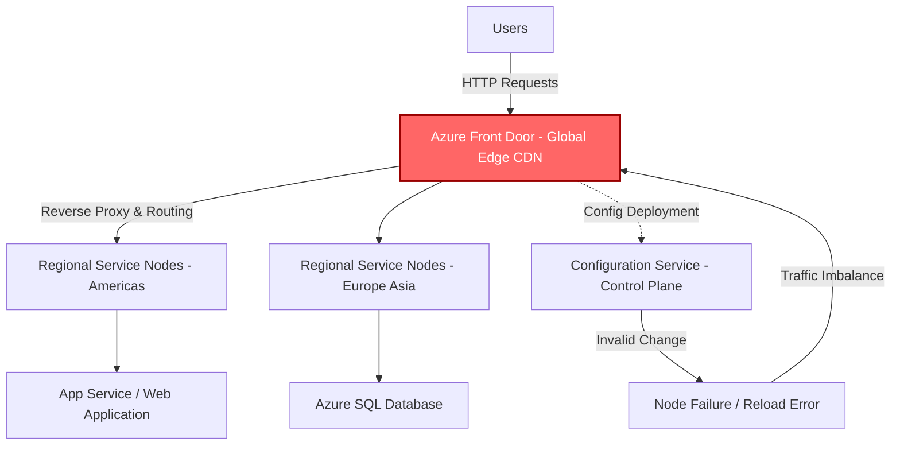

# 🌐 Azure Front Door Outage — 29 October 2025

## 🧭 Overview
Between **15:45 UTC (29 Oct)** and **00:05 UTC (30 Oct 2025)**, Microsoft Azure experienced a widespread service disruption caused by an invalid configuration rollout in **Azure Front Door (AFD)** — its global **Application Delivery Network / CDN / Layer 7 load balancer**.

The incident disrupted customer applications and Microsoft-hosted services worldwide, including authentication, data, and management portals.

This document summarises:

  - [Root Cause](#-root-cause)
  - [Timeline](#-timeline)
  - [Impact](#-impact)
  - [Contributing Factors](#-contributing-factors)
  - [Lessons Learned](#-lessons-learned-devops--devsecops--sre)
  - [Architecture Diagram](#-mermaid-architecture-diagram)

---

## ⚙️ Root Cause
An **inadvertent tenant-level configuration change** triggered an **invalid state across AFD nodes**, causing them to fail to load properly.  
A software defect in the deployment pipeline allowed the faulty configuration to **bypass validation safeguards**, propagating globally.

As unhealthy nodes dropped out, traffic was re-routed to a reduced pool of healthy nodes → overload → cascading timeouts and connection errors.

Microsoft mitigated by:
- Blocking new configuration changes.
- Deploying the *“last known good”* configuration globally.
- Gradually reloading and rebalancing traffic to restore full scale.

---

## 🕒 Timeline

    | Time (UTC) | Event |
    |:-----------|:------|
    | **15:45** | Customer impact begins (latency / timeouts / errors). |
    | **16:04** | Monitoring alerts trigger incident investigation. |
    | **16:18** | Public update posted to Azure Status page. |
    | **16:20** | Targeted Service Health notifications sent to customers. |
    | **17:26** | Azure Portal failed away from AFD to alternate endpoints. |
    | **17:30** | Blocked all new AFD configuration changes. |
    | **17:40** | Initiated deployment of “last known good” configuration. |
    | **18:30** | Fixed configuration pushed globally. |
    | **18:45** | Node recovery and gradual routing to healthy nodes begin. |
    | **23:15** | PowerApps dependency mitigated; customers confirm recovery. |
    | **00:05 (30 Oct)** | Full mitigation confirmed; AFD impact resolved. |

---

## 🌍 Impact

- **Duration:** ≈ 8 hours 20 minutes  
- **Scope:** Global – Americas, Europe, APAC, Middle East & Africa, Azure Gov, China, Jio regions  
- **Severity:** 🔴 Critical  
- **Primary Service:** Azure Front Door (AFD)  
- **Affected Azure Services:**

    | Category | Examples |
    |:----------|:----------|
    | Identity & Access | Azure AD B2C / Entra ID (Mobility Mgmt Policy, IAM, UX) |
    | App & Data | App Service, Azure SQL Database, Databricks, Container Registry |
    | Security | Microsoft Defender EASM, Copilot for Security, Sentinel (Threat Intel) |
    | Platform | Azure Portal, Virtual Desktop, Purview, Media Services, Video Indexer |

- **External Organisations Impacted:** Heathrow Airport, Alaska Airlines, Starbucks, Costco, Vodafone UK, Scottish Parliament (voting suspended), and others.

---

## 🧩 Contributing Factors

- **🔧 Validation Bypass:** Software defect allowed bad config to skip safety checks.  
- **🌐 Global Blast Radius:** AFD’s central role as a global entry point created a logical single point of failure.  
- **⚖️ Load Imbalance:** Unhealthy nodes dropped out, overloading remaining ones.  
- **🧱 Configuration Propagation:** Changes replicated to global fleet before error detected.  
- **🔁 Recovery Complexity:** Phased reload required to avoid further instability.

---

## 💡 Lessons Learned (DevOps / DevSecOps / SRE)

    | Theme | Recommendation |
    |:------|:----------------|
    | **Change Control** | Enforce multi-stage validation and canary deployments for global configs. |
    | **Rollback Mechanisms** | Automate rollback on anomaly detection and failed config loads. |
    | **Blast Radius Reduction** | Segment edge fleets (logical tenancy) to contain faulty rollouts. |
    | **Observability** | Deploy real-time health probes and synthetic monitors on config state load. |
    | **Incident Readiness** | Maintain origin failover paths (e.g., Traffic Manager redirects). |
    | **Security Awareness** | Educate users about phishing risks following major outages. |
    | **Governance** | Periodically review change-management guardrails for critical edge services. |

---

## 🧱 Mermaid Architecture Diagram

### Mermaid

---

*Disclaimer: This case study is for educational and analytical purposes.  
All information is based on publicly available sources and official Microsoft communications.*
