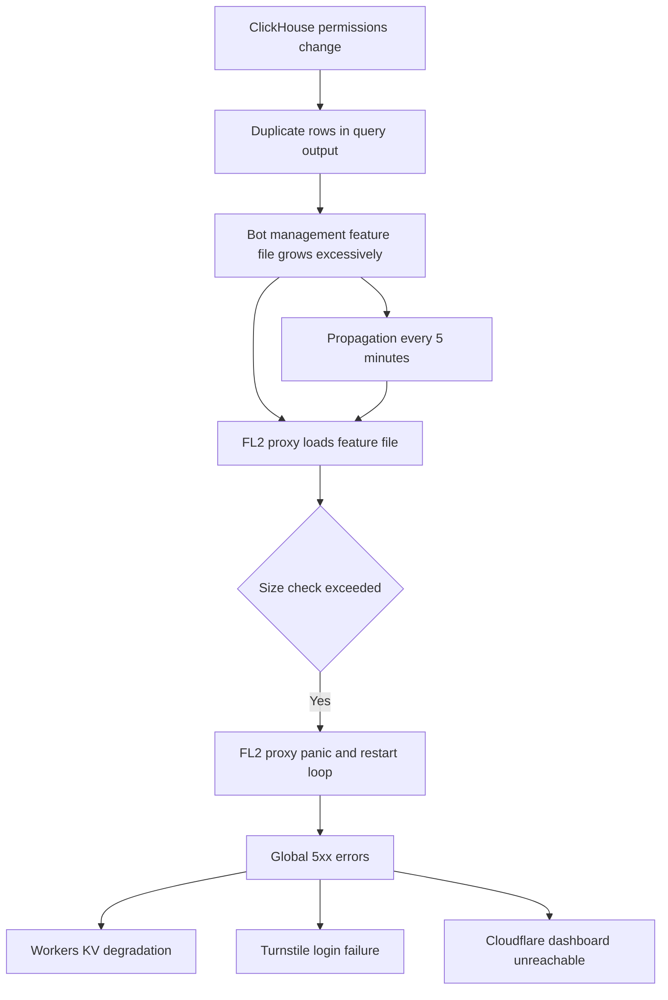

## 📝 Overview  

On **18 November 2025**, Cloudflare experienced its most severe global outage since 2019.  
A malformed, auto-generated configuration file caused Cloudflare’s new Rust-based FL2 proxy to **panic**, resulting in global **5xx errors** across millions of domains.

High-impact services (ChatGPT, X/Twitter, crypto platforms, SaaS APIs) degraded or failed completely.  
The proxied infrastructure chain—Workers KV, Turnstile, and the Cloudflare Dashboard—also broke, slowing internal remediation.

This document summarises:

- [Root Cause](#1--root-cause-technical)
- [Timeline](#2--timeline-utc)
- [Impact](#3--impact)
- [Contributing Factors](#4--contributing-factors)
- [Mitigation & Recovery Actions](#5--mitigation--recovery-actions)
- [Lessons Learned](#6--lessons-learned-devops--devsecops--sre)
- [Architecture Diagram](#7--architecture-diagram)

---

# 1. 🔍 Root Cause (Technical)

### **Primary Technical Cause**  
A ClickHouse permissions update unintentionally allowed duplicate rows to appear in a query used to generate Cloudflare’s **Bot Management feature file**.

This file normally contains <200 bot-detection features.  
The duplicated entries **doubled** the file size and exceeded a **hard-coded limit** expected by the FL2 proxy.

When FL2 attempted to load the file:

- The proxy encountered an unexpected state  
- A `Result::unwrap()` on `Err` caused a **panic**  
- Proxies restarted repeatedly, serving **500 Internal Server Errors**

### **Why It Cascaded Globally**  
- The malformed file propagated **every ~5 minutes** to edge nodes.  
- Some nodes received the “good” file; others received the faulty one → global traffic instability.  
- Dashboard login (Turnstile), Workers KV, and internal tooling sat **behind the same proxy layer**, making engineering access difficult.

---

# 2. 📅 Timeline (UTC)

| Time            | Event  |
|-----------------|--------|
| **11:05**       | ClickHouse permissions changed → duplicates introduced  |
| **11:28–11:32** | Initial global 5xx errors detected |
| **12:00**       | Outage escalates; bot-management file continues propagation |
| **13:05**       | Cloudflare applies mitigations (bypass Workers KV & Access) |
| **14:24–14:30** | Propagation halted; known-good configuration restored |
| **17:06**       | Full global restoration declared |

---

# 3. 🌍 Impact

### **Global Internet Impact**
- Millions of websites returned **500 Internal Server Errors**
- Popular platforms and APIs failed:
  - ChatGPT  
  - X (Twitter)  
  - Crypto front-ends  
  - SaaS products behind Cloudflare  
  - Numerous API-based mobile apps  

### **Cloudflare Internal Impact**
- Cloudflare Dashboard login failed (Turnstile dependency)  
- Workers KV unavailable  
- Engineers had reduced access to internal tooling during the outage  
- Mixed configuration states complicated diagnosis and rollback  

---

# 4. ⚠️ Contributing Factors

### ✔ Hard-coded feature limit  
A strict, unvalidated assumption (“≤200 features”) led to runtime panic.

### ✔ Lack of configuration-size validation  
Feature file growth was not monitored or schema-validated.

### ✔ Automated, timed propagation  
The bad file propagated widely before intervention.

### ✔ Over-coupled system components  
Bot-management → proxy → Workers → Dashboard formed a single blast radius.

### ✔ Internal change misclassified as low-risk  
Typical organisational oversight: “internal change = safe”.  
This incident disproves that assumption.

---

# 5. 🛠 Mitigation & Recovery Actions

### Cloudflare Steps
- Disabled propagation of the malformed feature file  
- Deployed known-good file  
- Bypassed Workers KV and Access for engineer access  
- Restarted FL2 proxies with verified configuration  
- Sequentially validated edge nodes until global stability restored  

### Residual Behaviour
- Latency fluctuations persisted briefly  
- Dependent services recovered at different speeds based on node propagation order  

---

# 6. 📚 Lessons Learned (DevOps / DevSecOps / SRE)

### **1. Treat all config surfaces as high-risk**  
Auto-generated configs require:

- schema validation  
- size limits  
- duplication detection  
- checksums  
- CI/CD pre-deployment checks  

### **2. Fallback paths prevent catastrophic failure**  
A bot-management failure should degrade service, not collapse core traffic.

### **3. Propagation must be controlled and observable**  
Implement:

- Canary nodes  
- Validation gates  
- Automatic rollback  
- Propagation metrics  

### **4. Monitor assumptions—not just metrics**  
Alert on:

- File size anomalies  
- Duplicate feature count  
- Proxy panic loops  
- Blast radius changes  

### **5. Internal changes need staging and risk assessment**  
Security/metadata changes can create unintended side effects.

### **6. Access paths must survive outages**  
Engineering access should not rely on the same components under failure.

---

# 7. 🏗️ Architecture Diagram  
### Propagation of Faulty Feature File → Global Failure (Mermaid)

---

*Disclaimer: This case study is for educational and analytical purposes.  
All information is based on publicly available sources and official Cloudflare communications.*
