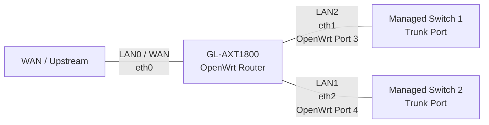

# GL-AXT1800 Port Mapping

The GL.iNet GL-AXT1800 uses different identifiers for its physical Ethernet ports, Linux network interfaces, and OpenWrt switch ports.

This can cause confusion when configuring VLANs, trunks, bridges, or firewall policies because the physical LAN labels do not directly correspond to the Linux `ethX` interface numbering.

## Port Mapping

| Physical Port | Linux Device | OpenWrt Switch Port | Typical Usage |
|---|---|---:|---|
| LAN0 / WAN | `eth0` | — | WAN / upstream connection |
| LAN2 | `eth1` | Port 3 | LAN or VLAN trunk |
| LAN1 | `eth2` | Port 4 | LAN or VLAN trunk |

The important mapping is:

```text
Physical LAN2 → eth1 → OpenWrt Port 3
Physical LAN1 → eth2 → OpenWrt Port 4
```

> [!IMPORTANT]
> The physical LAN numbering printed on the GL-AXT1800 chassis does **not** correspond directly to the Linux `ethX` numbering or OpenWrt switch-port numbering.

This distinction should be taken into account when configuring VLAN membership, tagged trunks, bridges, or switch-port-specific settings.

## Example Topology

The following example shows the two LAN ports being used as VLAN trunks to separate managed switches.



When writing OpenWrt configuration or troubleshooting VLAN connectivity, use the **Linux/OpenWrt interface mapping** rather than relying solely on the physical labels printed on the router.

## Reference

- [GL.iNet Forum — GL-AXT1800 VLAN Support](https://forum.gl-inet.com/t/gl-axt1800-vlan-support/23515/3)
